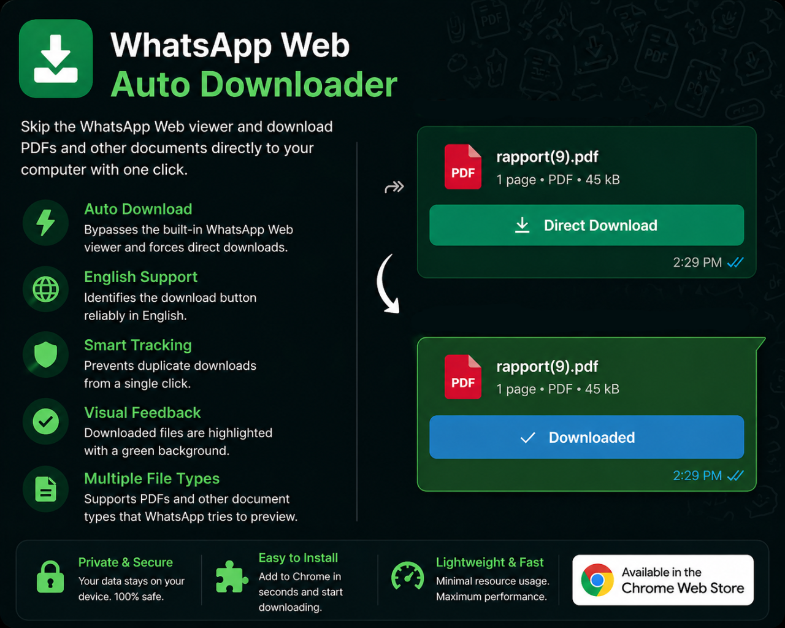

# WhatsApp Web PDF Viewer Bypass

A Chrome extension that bypasses the built-in WhatsApp Web PDF viewer and forces direct downloads of PDF files (and other document types) directly to your computer.

## Features
- **Auto Download**: Skips the WhatsApp PDF viewer when clicking on PDF files.
- **Support for Arabic & English**: Identifies the download button based on multiple languages.
- **Smart Tracking**: Ensures files aren't downloaded multiple times from a single click.
- **Visual Feedback**: Modifies the file item interface to show it has been downloaded (green background).
- **Supports Multiple File Types**: Primarily targets PDFs but also provides support for other file types that WhatsApp Web attempts to preview.

## Installation

### Method 1: Load Unpacked (For Developers)
1. Clone or download this repository.
2. Open Google Chrome and go to `chrome://extensions/`.
3. Enable **Developer mode** in the top right corner.
4. Click on **Load unpacked** and select the directory of this extension.

### Method 2: Install via CRX file
1. Locate the `.crx` file in the project.
2. Open Google Chrome and go to `chrome://extensions/`.
3. Drag and drop the `.crx` file onto the extensions page.

## Usage
Simply open WhatsApp Web, and click on any PDF file. The extension will automatically download the file instead of opening it in the preview overlay.

## License
MIT
